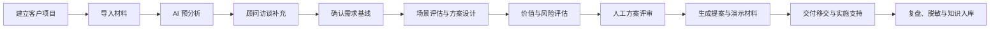
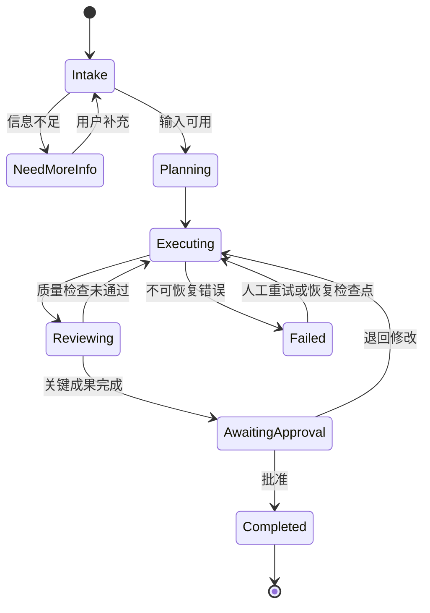
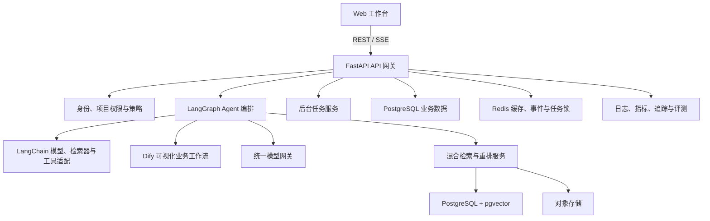
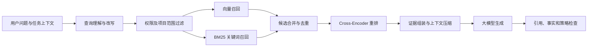

# AI 高级业务顾问 Agent 产品与系统设计蓝图

> 状态：已确认  
> 日期：2026-07-17  
> 首批用户：企业内部售前、咨询、解决方案与项目交付团队

## 1. 执行摘要

本产品定位为企业内部使用的“AI 高级业务顾问工作台”。它以客户项目为业务载体，以可控的多智能体协作为核心，贯通售前需求分析、AI 场景设计、方案与提案撰写、项目交付支持以及实践知识沉淀。

首版不是无人监管的自治数字员工，而是专业顾问的 Copilot 与协作平台。Agent 可以分析、检索、规划、生成和调用受控工具，但需求确认、商业数字、对客方案、知识入库以及外部系统写入必须经过人工审批。

核心产品价值：

1. 将分散的客户材料转化为结构化、版本化的项目知识。
2. 缩短需求分析和方案初稿时间，提高售前响应速度。
3. 通过 RAG、重排、引用和证据分级降低幻觉风险。
4. 将优秀项目经验脱敏后沉淀为可复用的行业方案资产。
5. 让售前成果自然衔接需求细化、培训、上线与验收。

## 2. 产品目标与边界

### 2.1 目标用户

- 售前顾问：收集需求、识别场景、输出方案和演示材料。
- 解决方案架构师：设计业务与技术架构，评估集成边界。
- 项目经理与实施顾问：细化需求、规划交付、培训和上线。
- 行业专家：审核专业结论，维护行业知识与模板。
- 知识管理员：审核、脱敏和发布企业知识资产。
- 平台管理员：管理用户、模型、策略、监控和审计。

### 2.2 核心交付物

- 客户背景与现状分析
- 访谈提纲、会议纪要和待确认事项
- 结构化需求基线与优先级
- AI 场景清单及场景评估矩阵
- 业务流程、技术架构和实施路线
- ROI/TCO 测算与风险分析
- 项目建议书、演示大纲、讲稿和客户问答
- 需求规格、验收标准、培训材料及上线清单
- 经脱敏审核的案例、模板和最佳实践

### 2.3 首版明确不做

- 未经授权自动联系客户或发送对外材料
- 自动报价、合同决策或承诺实施范围
- 无审批写入 CRM、ERP、项目管理等核心系统
- 将客户项目资料自动发布到公共知识库
- 用模型内部推理代替可审计的执行状态和证据

### 2.4 成功指标

| 指标 | 首期目标 |
|---|---:|
| 方案初稿耗时 | 降低 60% |
| 历史知识复用率 | ≥ 50% |
| 关键事实引用可追溯率 | ≥ 95% |
| 顾问采纳或轻度修改后采纳率 | ≥ 70% |
| 跨项目越权检索 | 0 |
| 关键审批留痕率 | 100% |

## 3. 产品形态与用户旅程

系统以“客户项目空间”为中心。项目空间包含材料、会话、需求、场景、方案、任务、审批、交付物和知识候选资产，而不是只保存聊天记录。

上游材料发生变化时，系统通过成果依赖关系标记受影响的下游内容，由用户决定重新生成、局部修订或保留旧版本，禁止静默覆盖。

## 4. Agent 角色体系

### 4.1 高级业务顾问总控 Agent

负责识别意图、检查输入、建立执行计划、选择专业 Agent、维护任务状态、汇总结果和触发人工审批。资料不足时必须输出信息缺口和下一轮访谈问题，不得自行填补事实。

### 4.2 专业 Agent

| Agent | 核心职责 | 主要产物 | 必须遵循的约束 |
|---|---|---|---|
| 需求分析 Agent | 提取目标、流程、痛点、约束和干系人 | 需求基线、访谈问题 | 区分原文事实与推断 |
| 场景与方案 Agent | 识别 AI 场景，设计业务和技术方案 | 场景矩阵、方案架构 | 明确适用条件与系统边界 |
| 价值与风险 Agent | 测算成本收益并识别风险 | ROI/TCO、风险台账 | 数字必须有公式、来源和区间 |
| 提案撰写 Agent | 将已批准结论组织为专业材料 | 提案、汇报稿、FAQ | 不新增未经批准的承诺 |
| 交付支持 Agent | 将方案转化为可执行交付计划 | 需求清单、验收与上线计划 | 保持需求到验收的追溯关系 |
| 知识管家 Agent | 提取、脱敏和组织可复用资产 | 案例、模板、实践卡片 | 人工审核后才可发布 |

### 4.3 Agent 协作状态机

## 5. 总体技术架构

推荐“自研 Agent 核心 + Dify 可视化工作流”的混合架构。核心业务状态、权限、审计和长流程编排由自研平台控制；Dify 承载业务人员需要频繁调整且风险较低的标准流程。

### 5.1 技术分工

| 技术 | 责任边界 |
|---|---|
| FastAPI | API、鉴权、项目域服务、SSE、审批与集成入口 |
| LangGraph | Agent 状态机、任务编排、检查点、人工介入、失败恢复 |
| LangChain | 模型、Embedding、检索器、提示词和工具适配 |
| Dify | 文档摘要、标准报告等可视化、可配置业务流程 |
| PostgreSQL | 项目、任务、审批、版本、审计及配置数据 |
| pgvector | 首版向量检索，减少基础设施复杂度 |
| Redis | 缓存、限流、分布式锁、SSE 事件和短期会话状态 |
| S3 兼容对象存储 | 原始材料、解析产物和生成的交付文档 |
| 后台任务队列 | OCR、解析、索引、长报告生成和批量评测 |

### 5.2 Dify 与自研编排边界

Dify 工作流必须通过受控适配器调用，输入输出使用版本化 JSON Schema。Dify 不保存项目的权威状态，不直接决定权限，不持有长期业务事务，也不绕过平台审批。工作流失败、超时或版本变化均由平台记录并处理。

## 6. RAG、重排与知识治理

### 6.1 知识分层

1. 企业标准知识：产品能力、规范、规则、模板与合规要求。
2. 行业场景知识：日企业务流程、痛点、指标和成熟解决方案。
3. 客户项目知识：客户材料、访谈、会议纪要、需求和项目成果。
4. 实践资产知识：脱敏并审核后的案例、复盘、提示词和模板。

### 6.2 入库管道

`文件校验 → 病毒检查 → 格式解析/OCR → 表格与章节识别 → 敏感信息识别 → 语义切分 → 元数据补充 → 向量化 → 索引 → 质量检查 → 发布`

每个片段至少保存：企业、客户、项目、知识层级、文档 ID、版本、章节、页码、语言、有效期、敏感级别、访问控制和内容哈希。

### 6.3 检索链路

RAG 输出必须区分：有来源的事实、基于事实的推断、待人工确认的假设。无充分证据时回答“资料不足”，同时生成待补充信息清单。商业数字必须展示公式、参数来源和敏感性区间。

### 6.4 向量数据库选择

首版使用 PostgreSQL + pgvector，便于事务、权限元数据和向量检索统一管理。当向量规模、吞吐或多副本检索出现明确瓶颈后，再以抽象的 VectorStore 接口迁移至 Qdrant 或 Milvus，避免过早引入复杂运维。

## 7. 核心领域模型

| 实体 | 说明 |
|---|---|
| Organization/User/Role | 企业、用户与角色权限 |
| Client/Project/Member | 客户、项目空间和成员授权 |
| SourceDocument/Chunk | 原始材料、版本、解析片段与索引状态 |
| Conversation/Message | 会话与消息，不作为唯一业务状态 |
| AgentRun/RunStep/Event | Agent 运行、步骤和 SSE 事件 |
| Requirement/Scenario/Solution | 需求、候选场景和方案对象 |
| Deliverable/Revision | 交付物及其不可变版本 |
| Approval | 审批对象、结论、意见和审批人 |
| Citation | 成果结论到证据片段的关联 |
| KnowledgeAsset | 审核后发布的可复用知识资产 |
| Evaluation/Score | 自动或人工评测记录 |
| AuditLog | 安全与业务审计事件 |

所有业务记录都携带 `organization_id`；项目数据同时携带 `project_id`。权限过滤在数据库查询、向量检索、对象下载和工具调用四层一致执行。

## 8. API 与 SSE 事件边界

### 8.1 建议 API 域

- `/api/v1/projects`：项目、成员、项目阶段与状态。
- `/api/v1/documents`：上传、解析、版本、索引和引用预览。
- `/api/v1/conversations`：项目内对话和消息。
- `/api/v1/agent-runs`：创建、查询、取消、重试和恢复 Agent 任务。
- `/api/v1/deliverables`：交付物、版本、导出和依赖影响。
- `/api/v1/approvals`：提交、批准、退回和审批记录。
- `/api/v1/knowledge-assets`：知识候选、脱敏、审核和发布。
- `/api/v1/evaluations`：评测集、运行和结果。

### 8.2 SSE 事件模型

客户端通过 `GET /api/v1/agent-runs/{run_id}/events` 订阅事件。事件包含递增 ID，并支持 `Last-Event-ID` 断线续传。建议事件类型：

- `run.started`
- `plan.created`
- `step.started` / `step.completed`
- `retrieval.completed`
- `tool.started` / `tool.completed`
- `content.delta`
- `approval.required`
- `run.completed` / `run.failed` / `run.cancelled`

事件只展示可解释的执行状态、证据和产出，不暴露模型私有思维链。幂等键确保客户端重连不会重复启动任务。

## 9. 人机协作与审批

以下节点必须人工确认：

1. 需求基线：项目负责人确认范围、优先级和约束。
2. 商业测算：负责人确认假设、单价、工时和收益数字。
3. 对客方案：售前负责人确认内容、承诺、风险和品牌规范。
4. 外部系统写入：用户预览差异后明确授权。
5. 知识入库：知识管理员确认脱敏、所有权和复用范围。

审批采用不可变快照；批准后若上游依赖改变，原批准仍保留但成果被标记为“需要重新确认”。

## 10. 安全、合规与审计

- 对接企业 SSO，采用角色权限与项目成员授权相结合的模型。
- 使用短期访问令牌；服务账号和密钥存放在密钥管理系统。
- 传输和存储加密，对象下载使用短期签名地址。
- 上传材料执行恶意文件、提示注入和敏感信息检查。
- 模型网关按数据等级路由；高敏项目可禁止外部模型。
- 日志默认脱敏，不记录完整文件、密钥和不必要的原始提示词。
- 工具执行采用允许列表、参数校验、超时和最小权限凭据。
- 所有检索、下载、生成、审批、发布及管理操作写入审计日志。
- 客户项目知识默认不得进入企业实践库，必须脱敏并重新审批。

## 11. 容错、可观测性与成本控制

LangGraph 为长任务保存检查点。可恢复错误执行指数退避重试；模型不可用时按策略切换备用模型；无法安全恢复时保留现场并转人工处理。Dify 和外部系统调用使用熔断、超时和幂等键。

关键监控指标：API 成功率、SSE 连接数、首字延迟、任务总耗时、各 Agent 成功率、检索命中率、重排后引用覆盖率、令牌与模型成本、人工修改率、审批等待时间和失败原因分布。

成本控制包括：任务级预算、上下文压缩、Embedding 去重缓存、按任务选择模型、长任务并发限制、超限中止或审批，以及组织/项目维度成本报表。

## 12. 质量评测与测试策略

### 12.1 Agent 质量评测

- 需求抽取：字段完整率、事实一致性、遗漏率。
- RAG：Recall@K、MRR/NDCG、引用正确率、引用覆盖率。
- 方案质量：场景适配、可实施性、约束覆盖和风险完整性。
- 商业测算：公式正确性、参数可追溯性和敏感性分析。
- 提案质量：结构完整、风格一致、无新增承诺。
- 知识沉淀：脱敏准确率、去重率和复用价值。

### 12.2 工程测试

- 单元测试：领域规则、策略、切分、权限和数据转换。
- 集成测试：数据库、向量检索、对象存储、Dify 与模型网关。
- 工作流测试：中断恢复、人工审批、幂等、取消和超时。
- 安全测试：跨项目越权、提示注入、敏感泄露和恶意文件。
- 性能测试：并发 SSE、批量索引、长报告和向量查询。
- 回归评测：每次提示词、模型、工作流或知识索引版本升级前执行。

生产样本必须脱敏后才能进入离线评测集。评测门槛是灰度发布的必要条件，而不是仅用于报表展示。

## 13. 部署拓扑与环境策略

第一阶段采用 Docker Compose 部署 FastAPI、Worker、PostgreSQL/pgvector、Redis 和对象存储。开发、测试和生产环境分别使用独立数据库、对象桶、模型凭据和 Dify 工作区。

达到明确的并发、高可用或多团队隔离需求后迁移 Kubernetes。届时 API 与 Worker 独立扩缩容，数据库与对象存储优先使用托管或企业统一基础设施。提示词、Agent 图、Dify 工作流、模型策略和索引配置全部版本化并支持灰度与回滚。

## 14. 分阶段实施路线

### 阶段一：产品验证（3–4 周）

完成项目空间、材料上传、解析索引、基础 RAG/重排、SSE 对话、需求分析 Agent 和场景方案 Agent，输出带引用的需求分析和方案初稿。选择 2–3 个真实历史项目验证。

**退出标准：** 引用可追溯、无跨项目数据泄露、需求与方案达到顾问可评审状态，历史项目验证结果可量化。

### 阶段二：业务闭环（4–6 周）

加入总控 Agent、价值评估、提案撰写、交付支持、知识沉淀、人工审批、版本管理、导出和 Dify 工作流，建立标准模板和第一版离线评测集。

**退出标准：** 从材料导入到交付移交和知识候选形成完整闭环，关键节点均可审批与追溯。

### 阶段三：生产化（4–6 周）

接入企业身份系统，完善权限、审计、敏感信息识别、模型网关、任务恢复、监控告警、成本控制和灰度发布，并以受控方式接入文档库、CRM 或项目管理系统。

**退出标准：** 通过安全、性能、恢复和用户验收测试，具备生产运行手册、回滚方案和责任人。

### 阶段四：规模化优化（持续）

基于生产数据优化检索、重排、提示词、Agent 路由和模型选择；按真实瓶颈评估 Qdrant/Milvus、Kubernetes、多模态材料理解与行业知识图谱。

## 15. 主要风险与缓解措施

| 风险 | 缓解措施 |
|---|---|
| 生成内容看似专业但事实错误 | 强制引用、证据分级、质量检查和人工审批 |
| 客户数据跨项目泄露 | 检索前 ACL、数据库隔离测试、审计和红队测试 |
| Agent 流程复杂且不可控 | 有限状态机、预算、最大步骤、超时和人工接管 |
| Dify 与自研逻辑重复 | 明确权威状态和适用边界，使用版本化适配器 |
| 历史材料质量差 | 入库质量评分、OCR 复核、无证据即拒答 |
| 商业收益被误当作承诺 | 展示假设和区间，商业测算必须单独审批 |
| 模型升级造成质量回退 | 固定版本、离线回归评测、灰度和快速回滚 |
| 基础设施过早复杂化 | 首版 pgvector + Compose，按真实指标演进 |

## 16. 架构决策记录

1. 采用多智能体协作，但以一个总控 Agent 统一规划和治理。
2. LangGraph 负责核心长流程与状态，LangChain 负责模型和工具适配。
3. Dify 负责可视化标准流程，不作为业务权威状态存储。
4. 首版采用 PostgreSQL + pgvector，保留向量数据库抽象层。
5. 对话使用 SSE；长任务通过后台队列执行并支持断线续传。
6. 所有关键业务成果结构化、版本化并绑定证据与审批。
7. 首版面向内部团队，安全模型按未来企业化扩展预留组织边界。

## 17. 下一步建议

进入研发前，建议补充三项输入：企业现有身份与文档系统、可用于验证的 2–3 个脱敏历史项目、首期允许接入的模型与数据合规边界。随后基于本蓝图编写详细实现计划、OpenAPI 契约、数据库 ERD、Agent 状态 Schema 和阶段一验收用例。
