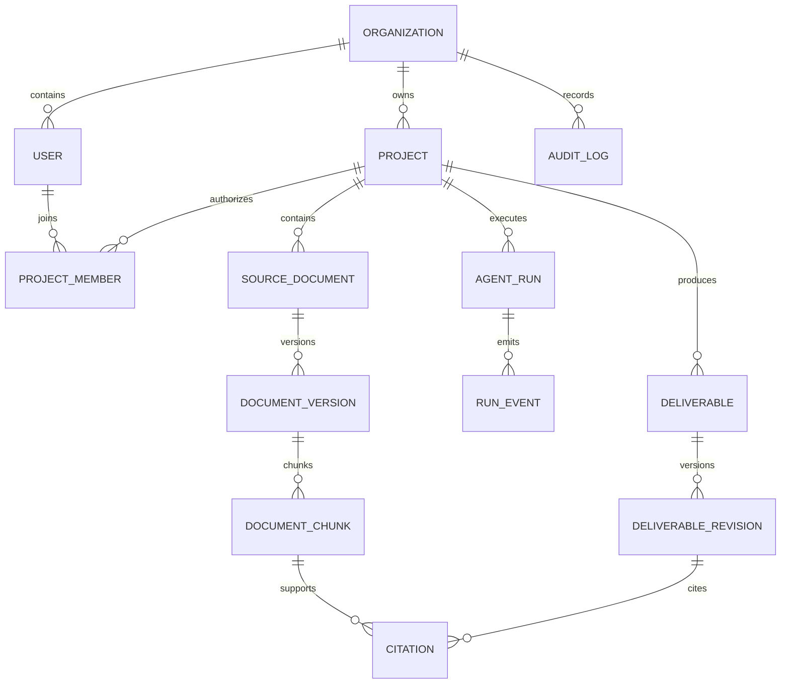

# 阶段一技术契约

> 本文是阶段一实现的稳定边界。示例字段可扩展，但不得在无版本升级的情况下改变语义。

## 1. API 通用规则

- Base path：`/api/v1`
- Content-Type：`application/json`；上传使用 `multipart/form-data`
- 标识符：UUID v7 或服务端生成的时间有序 UUID
- 时间：ISO 8601 UTC，例如 `2026-07-17T08:00:00Z`
- 分页：游标分页，参数为 `limit` 与 `cursor`
- 幂等：创建 AgentRun 必须支持 `Idempotency-Key`
- 错误：`application/problem+json`，遵循 RFC 9457
- 版本：响应包含 `ETag`；并发修改使用 `If-Match`

Problem Details 示例：

```json
{
  "type": "https://example.internal/problems/invalid-state",
  "title": "Invalid state transition",
  "status": 409,
  "detail": "Only ready documents can be searched.",
  "instance": "/api/v1/documents/019...",
  "request_id": "019...",
  "code": "DOCUMENT_NOT_READY"
}
```

## 2. 核心 API

| Method | Path | 语义 | Success |
|---|---|---|---:|
| POST | `/projects` | 创建客户项目 | 201 |
| GET | `/projects` | 列出当前用户可见项目 | 200 |
| GET | `/projects/{project_id}` | 项目详情 | 200 |
| PATCH | `/projects/{project_id}` | 修改项目元数据/阶段 | 200 |
| POST | `/projects/{project_id}/members` | 添加项目成员 | 201 |
| POST | `/projects/{project_id}/documents` | 上传新文档版本 | 202 |
| GET | `/projects/{project_id}/documents` | 文档列表与处理状态 | 200 |
| GET | `/documents/{document_id}/versions/{version_id}` | 文档版本及解析状态 | 200 |
| POST | `/projects/{project_id}/retrieval:search` | 调试/证据检索 | 200 |
| POST | `/projects/{project_id}/agent-runs` | 创建 Agent 任务 | 202 |
| GET | `/agent-runs/{run_id}` | 任务状态 | 200 |
| POST | `/agent-runs/{run_id}:cancel` | 取消任务 | 202 |
| GET | `/agent-runs/{run_id}/events` | SSE 事件流 | 200 |
| GET | `/projects/{project_id}/deliverables` | 成果列表 | 200 |
| GET | `/deliverables/{deliverable_id}` | 成果及当前修订 | 200 |
| GET | `/deliverables/{deliverable_id}/revisions` | 不可变修订历史 | 200 |

## 3. 创建 AgentRun

Request：

```json
{
  "agent": "requirement_analysis",
  "input": {
    "objective": "分析客户现状并形成需求基线",
    "document_version_ids": ["019..."],
    "confirmed_facts": [],
    "constraints": []
  },
  "options": {
    "language": "zh-CN",
    "max_steps": 12,
    "retrieval_top_k": 8
  }
}
```

Response：

```json
{
  "id": "019...",
  "project_id": "019...",
  "agent": "requirement_analysis",
  "status": "queued",
  "created_at": "2026-07-17T08:00:00Z",
  "events_url": "/api/v1/agent-runs/019.../events"
}
```

## 4. SSE 契约

响应头至少包含：

```text
Content-Type: text/event-stream
Cache-Control: no-cache, no-transform
Connection: keep-alive
X-Accel-Buffering: no
```

事件示例：

```text
id: 42
event: retrieval.completed
data: {"run_id":"019...","step_id":"retrieve-1","candidate_count":30,"selected_count":8,"occurred_at":"2026-07-17T08:00:03Z"}
```

允许的事件类型：

- `run.started`
- `plan.created`
- `step.started`
- `retrieval.completed`
- `tool.started`
- `tool.completed`
- `content.delta`
- `step.completed`
- `input.required`
- `run.completed`
- `run.failed`
- `run.cancelled`

事件只包含公开执行状态，不包含模型思维链。客户端通过 `Last-Event-ID` 恢复。服务端每 15 秒发送 SSE 注释心跳。终态事件发出后关闭连接。

## 5. Agent 状态 Schema

```python
class ConsultantAgentState(TypedDict):
    schema_version: str
    run_id: str
    organization_id: str
    project_id: str
    actor_id: str
    agent_kind: Literal["requirement_analysis", "solution_design"]
    objective: str
    status: Literal[
        "planning", "retrieving", "analyzing", "reviewing",
        "awaiting_input", "completed", "failed", "cancelled"
    ]
    plan: list[PlanStep]
    current_step: int
    max_steps: int
    document_version_ids: list[str]
    evidence: list[EvidenceRef]
    facts: list[Claim]
    inferences: list[Claim]
    assumptions: list[Claim]
    information_gaps: list[InformationGap]
    draft: dict[str, object] | None
    quality_issues: list[QualityIssue]
    retry_count: int
    token_usage: TokenUsage
    errors: list[PublicRunError]
    deliverable_revision_id: str | None
```

约束：

- `max_steps` 默认 12，硬上限 20。
- EvidenceRef 必须属于同一组织、项目和允许的文档版本。
- Claim 的 `kind` 必须是 `fact`、`inference` 或 `assumption`。
- fact 必须至少关联一个 EvidenceRef；否则质量门失败。
- 状态中不保存无限增长的完整聊天，仅保存消息 ID 和压缩摘要。
- 每次节点执行前检查取消标志、预算和状态版本。

## 6. 需求基线 Schema

```json
{
  "schema_version": "1.0",
  "customer_context": {
    "industry": null,
    "business_unit": null,
    "project_background": []
  },
  "business_objectives": [],
  "stakeholders": [],
  "current_processes": [],
  "pain_points": [],
  "requirements": [
    {
      "id": "REQ-001",
      "title": "",
      "description": "",
      "priority": "must|should|could|wont",
      "acceptance_hint": "",
      "claim_kind": "fact|inference|assumption",
      "citation_ids": []
    }
  ],
  "constraints": [],
  "risks": [],
  "information_gaps": [],
  "interview_questions": [],
  "citations": []
}
```

## 7. 场景与方案 Schema

```json
{
  "schema_version": "1.0",
  "executive_summary": "",
  "candidate_scenarios": [
    {
      "id": "SCN-001",
      "name": "",
      "business_problem": "",
      "users": [],
      "expected_value": [],
      "feasibility": "high|medium|low|unknown",
      "priority": "now|next|later|not_recommended",
      "required_capabilities": [],
      "dependencies": [],
      "risks": [],
      "citation_ids": []
    }
  ],
  "recommended_scope": [],
  "business_flow": [],
  "technical_components": [],
  "integration_boundaries": [],
  "non_functional_requirements": [],
  "implementation_phases": [],
  "open_questions": [],
  "citations": []
}
```

## 8. Citation Schema

```json
{
  "id": "CIT-001",
  "document_id": "019...",
  "document_version_id": "019...",
  "chunk_id": "019...",
  "document_title": "客户访谈纪要",
  "section": "3.2 当前流程",
  "page_start": 4,
  "page_end": 4,
  "quote": "经授权的短证据摘录",
  "content_hash": "sha256:..."
}
```

quote 只返回支持结论所需的最短片段，并受访问权限控制。引用在生成时再次检查文档版本状态和项目归属。

## 9. 数据模型与关键约束



关键约束：

- 项目资源均包含 `organization_id` 和 `project_id`。
- `document_versions` 对 `(document_id, version_number)` 唯一。
- `document_chunks` 对 `(document_version_id, content_hash, ordinal)` 唯一。
- 只有 `READY` 版本可以参与检索和引用。
- DeliverableRevision 不可更新，只能新增。
- Citation 的项目必须与 DeliverableRevision 项目一致。
- AgentRun 的幂等键对 `(organization_id, actor_id, idempotency_key)` 唯一。
- AuditLog 只追加，不提供业务 API 修改和删除。

## 10. 权限矩阵

| 操作 | Project Owner | Consultant | Viewer | Non-member |
|---|:---:|:---:|:---:|:---:|
| 查看项目 | ✓ | ✓ | ✓ | — |
| 上传/更新文档 | ✓ | ✓ | — | — |
| 启动 Agent | ✓ | ✓ | — | — |
| 查看成果与引用 | ✓ | ✓ | ✓ | — |
| 删除/归档项目 | ✓ | — | — | — |
| 管理成员 | ✓ | — | — | — |

非成员访问项目资源统一返回 404。权限检查发生在 Repository/检索条件构建之前，不能先查询内容再过滤。

## 11. 阶段一非功能指标

| 指标 | 目标 |
|---|---:|
| 健康检查 P95 | < 100 ms |
| 普通元数据 API P95 | < 500 ms |
| SSE 首个状态事件 P95 | < 1 s |
| 50 页文本 PDF 完成索引 | < 3 min（参考环境） |
| 混合检索 P95 | < 2 s（10 万片段） |
| SSE 同时连接 | 100（单实例验收） |
| Agent 失败后状态持久化 | 100% |
| 跨项目泄露 | 0 |
| 引用准确率 | ≥ 95% |

性能目标在固定参考环境和固定 Fixture 上测试，报告必须记录硬件、数据规模、模型模式和并发参数。

## 12. Dify 预留契约

阶段一不调用 Dify，但定义：

```python
class WorkflowRunner(Protocol):
    async def run(
        self,
        *,
        workflow_key: str,
        workflow_version: str,
        input: dict[str, object],
        context: ExecutionContext,
    ) -> WorkflowResult: ...
```

第二阶段的 DifyAdapter 必须通过平台模型网关、审计和权限上下文调用；Dify 返回值必须经过本地 JSON Schema 验证后才能进入业务状态。
