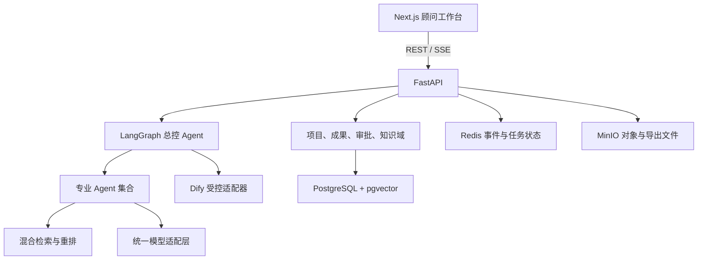
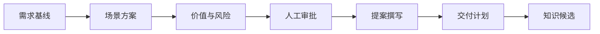

# AI 高级业务顾问 Agent 阶段二业务闭环设计

> 状态：已确认  
> 日期：2026-07-20  
> 阶段目标：从技术 MVP 演进为内部顾问团队可试用的业务闭环 Beta

## 1. 目标与范围

阶段二采用 **Next.js Web 工作台 + FastAPI 核心服务 + Dify 受控工作流**。系统围绕客户项目组织材料、需求、场景、方案、审批、交付物和知识资产，而不是以聊天记录作为唯一业务载体。

本阶段形成以下闭环：

阶段二新增：

- 总控、价值与风险、提案、交付支持和知识管家 Agent
- 需求、场景、商业测算、审批和知识资产等正式业务对象
- Agent 实时执行进度、人工暂停、退回修改和恢复
- 在线成果编辑、历史版本比较、引用核验及导出
- Dify 工作流适配、超时处理、版本记录和失败降级
- 顾问反馈、采纳率、引用质量及运行成本评测

企业 SSO、CRM 自动写回、Kubernetes 和全面生产监控保留到阶段三。

## 2. 架构与职责边界

继续使用模块化单体，避免过早拆分微服务。Next.js 是业务工作台，FastAPI 是唯一业务入口和权威状态管理者。

Next.js 负责项目导航、业务表单、成果编辑、引用查看、审批操作和 Agent 运行展示，不直接访问数据库、Dify 或模型。FastAPI 负责权限、状态转换、版本、审计和所有写操作。

总控 Agent 根据用户意图和项目阶段生成可解释的执行计划，再调用需求、方案、价值、提案、交付和知识 Agent。专业 Agent 只输出版本化结构数据，不直接修改其他业务对象。关键成果完成后进入 `awaiting_approval`，审批通过后才能成为下游 Agent 的正式输入。

Dify 通过统一适配器调用，首批承载材料摘要和标准提案组装。每次调用保存工作流 ID、版本、输入摘要、输出、耗时和错误信息。Dify 不拥有项目状态，不能绕过权限和审批。系统保留 Fake 模式，使本地演示和自动化测试不依赖外网。

## 3. 工作台信息架构

工作台采用左侧全局导航、顶部项目上下文和中央业务工作区。首页为项目看板，展示项目阶段、待审批事项、最近成果、材料状态和正在运行的 Agent。

项目内主要页面：

1. **项目概览**：客户背景、目标、里程碑、成员和风险提醒。
2. **材料中心**：上传、解析状态、版本、敏感等级和引用预览。
3. **需求与场景**：需求基线、信息缺口、场景矩阵和优先级。
4. **方案工作室**：方案章节、技术架构、价值测算、风险和引用。
5. **Agent 运行中心**：执行计划、当前步骤、证据、失败原因和人工接管。
6. **成果与审批**：在线编辑、版本比较、提交审批、退回意见和导出。
7. **交付与知识**：实施计划、验收标准、培训清单和脱敏知识候选。

Agent 运行时通过 SSE 展示业务级进度，不展示模型内部思维链。任务不依赖页面连接持续存在；重新进入页面后使用最后事件 ID 恢复。

在线编辑使用结构化表单与 Markdown 富文本组合。引用为可点击标记，可定位原始文档、章节和页码。人工修改形成新修订，不覆盖 Agent 原始输出。导出首批支持 Markdown、DOCX 和 PDF，并记录来源成果、修订版本和审批状态；未审批成果带有草稿标识。

## 4. 业务对象与协作规则

阶段二新增以下业务对象：

| 对象 | 作用 |
|---|---|
| `RequirementBaseline` | 客户目标、现状、痛点、约束、干系人和信息缺口 |
| `ScenarioAssessment` | AI 场景、价值、可行性、风险和优先级 |
| `BusinessCase` | 成本、收益、公式、参数来源、区间和敏感性分析 |
| `Proposal` | 对客方案章节、承诺边界、引用和审批状态 |
| `DeliveryPlan` | 里程碑、工作包、责任人、验收、培训和上线清单 |
| `Approval` | 审批对象快照、审批人、结论、意见和时间 |
| `KnowledgeCandidate` | 尚未发布的项目实践脱敏候选 |
| `WorkflowExecution` | Dify 工作流版本、输入输出、状态、耗时和错误 |

专业 Agent 输出统一区分 `facts`、`inferences`、`assumptions`、`citations` 和 `quality_issues`。事实必须有引用，推断说明依据，假设等待确认。商业数字必须记录公式和参数来源。

审批针对不可变快照。审批通过后，成果成为下游的正式输入；上游变化时，下游成果被标记为 `stale`，用户选择局部重生成、新建版本或保留并说明。知识候选只能来自已审批成果，并在自动脱敏检查和知识管理员审批后发布。

## 5. 异常处理与恢复

所有长任务均以可恢复的 AgentRun 执行。模型、Dify、检索或导出发生临时错误时有限重试并保存已完成步骤。超过重试次数后进入 `failed`，页面展示可理解的失败原因和从失败步骤重试入口。

Dify 调用设置超时、熔断和幂等键。Dify 不可用时，材料摘要回退到本地 Agent；提案组装保留已批准的结构化内容并提示稍后重试。SSE 断开不取消后台任务，重连后从最后事件恢复。审批冲突、过期版本和重复提交返回明确业务错误，不静默覆盖数据。

## 6. 质量、测试与验收

测试包括：

- 后端单元测试和领域状态测试
- API、数据库、Dify 适配器及导出集成测试
- 前端组件、页面状态和无障碍测试
- 从材料上传到知识候选的端到端测试
- 权限隔离、提示注入、引用泄漏和敏感信息安全测试

阶段二退出标准：

1. 顾问可通过 Web 工作台完成完整演示，无需手工调用 API。
2. 从材料到需求、方案、价值分析、提案、交付计划和知识候选形成闭环。
3. 关键成果经过审批，审批及版本变化可追溯。
4. 关键事实引用覆盖率不低于 95%，跨项目数据泄露为 0。
5. Agent 中断、SSE 重连和 Dify 暂时不可用均有恢复路径。
6. DOCX、PDF 和 Markdown 导出可用。
7. Fake 模式自动化测试稳定通过，并至少用一个真实历史项目完成试点验收。

